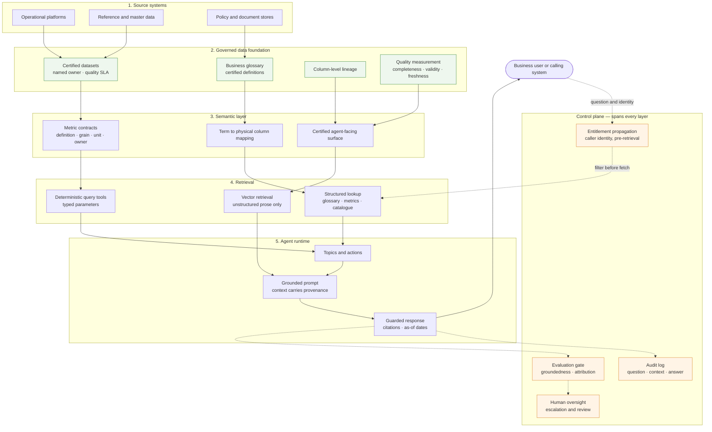

# Governed AI Grounding

**Retrieval quality is a data-governance problem, not a prompting problem.**

An agent answering questions over enterprise data is only as trustworthy as the certified datasets, business glossary, lineage and access controls underneath it. When an agent gives a confidently wrong answer about your business, the root cause is almost never the model — it is that two teams hold different definitions of "active customer", that the certified table was three weeks stale, or that nobody can say where the number came from. This repository is the architecture pattern for the layer in between: how to make enterprise data *groundable* before you point an agent at it.



---

## Table of contents

| Section | What's in it |
| --- | --- |
| 🔍 [The problem](#the-problem) | Six failure modes that come from ungoverned grounding |
| 🧭 [The pattern](#the-pattern) | The five-layer answer, in one page |
| [Repository map](#repository-map) | Where each document lives and who it's for |
| ▶️ [What's runnable here](#whats-runnable-here) | The eval harness and demo, standalone |
| 🏗️ [Platform notes](#platform-notes) | Agentforce and Data 360 as reference implementation |
| [Contributing](#contributing) | How to propose changes |
| [License](#license) | MIT |

**Documents**

- [`architecture/grounding-reference-architecture.md`](architecture/grounding-reference-architecture.md) — the five layers in depth, component responsibilities, query lifecycle
- [`architecture/semantic-layer-for-agents.md`](architecture/semantic-layer-for-agents.md) — metric contracts, disambiguation, exposing the layer as typed tools
- [`architecture/data-360-grounding-notes.md`](architecture/data-360-grounding-notes.md) — pattern-to-platform mapping for Salesforce Data 360 and Agentforce
- [`governance/ai-controls-mapping.md`](governance/ai-controls-mapping.md) — twelve control objectives, implementation and audit evidence
- [`governance/data-readiness-assessment.md`](governance/data-readiness-assessment.md) — scored 0–4 rubric to run *before* you build
- [`prompts/`](prompts/) — grounded answer template and guardrail patterns
- [`evaluation/`](evaluation/) — the runnable regression harness

---

## The problem

Most "the agent hallucinated" incidents in enterprise settings are not hallucinations in the research sense. They are the predictable output of pointing a competent model at data that was never governed for this purpose. Six failure modes account for the majority of them.

**1. Ambiguous metric definitions produce confidently different answers.**
"Revenue" means the statutory figure to Group Finance and the management-basis figure to a division. Both are certified. Both are correct. An agent that silently picks one gives two colleagues different numbers for the same question, each perfectly defensible in isolation, and the disagreement surfaces in a meeting rather than in a test. No prompt fixes this, because the ambiguity is in the business, not in the model.

**2. Stale certified data answers as though it were current.**
Certification and currency are different properties. A monthly delinquency snapshot is certified, owned, quality-checked — and useless as an answer to "what is it now" in month four. Without an as-of contract carried through retrieval and into the answer, the agent presents February's number in August with the same confidence as this morning's.

**3. Entitlement bypass through the retrieval path.**
Access control is usually enforced at the application, then quietly re-implemented (or forgotten) in the vector index and the caching layer. An agent that retrieves under a service identity and filters afterwards has already placed restricted content into a prompt, a log and possibly a cache. Retrieval must run under the caller's entitlements, evaluated *before* candidate context is fetched.

**4. No lineage, so the answer cannot be defended.**
Six months later a regulator, an auditor or a client asks how a figure was derived. If the agent cannot name the dataset, the transformation and the certification state behind it, the honest answer is that you do not know. Citations that resolve to a governed artefact are what turns a plausible answer into a defensible one.

**5. Uncertified data quietly becomes the source of truth.**
A sandbox extract gets indexed because it was convenient and had good coverage. It has no owner, no quality SLA and no lineage — and it is now answering client-facing questions. The failure is not that the data is wrong; it is that nobody is accountable for it being right.

**6. Numbers generated in prose instead of computed.**
Asked for a ratio, a language model will produce a plausibly-shaped number. Fabricated precision is the highest-severity failure in a regulated setting and the one users are least equipped to catch, because a wrong number looks exactly like a right one. Arithmetic belongs in a deterministic tool; the model's job is to narrate the result.

Notice what these have in common: every one is decided *before* the model is invoked, and none is fixed by a better prompt.

---

## The pattern

Five layers, each with one job, plus a control plane that cuts across all of them.

| Layer | Responsibility | The question it answers |
| --- | --- | --- |
| **Governed data foundation** | Certified datasets with named owners, quality SLAs, measured freshness | *Is this data fit to be believed?* |
| **Semantic layer** | Metric and term definitions as first-class contracts, mapped to physical columns | *What exactly does this word mean, and where does it live?* |
| **Retrieval** | Structured lookup by default, deterministic query tools for numbers, vector search only over prose | *What is the minimum correct context for this question?* |
| **Agent runtime** | Topics, actions and tools; deterministic actions preferred over free generation | *How is the answer assembled, and what may it do?* |
| **Control plane** | Entitlement propagation, audit, evaluation, human oversight | *Can we prove any of this after the fact?* |

Three principles hold the pattern together:

1. **Govern before you retrieve.** Certification, entitlement, freshness and ambiguity are pre-retrieval gates. A question that fails one should never reach a prompt. The demo in this repo resolves five of six questions without calling a model at all.
2. **Definitions are contracts, not documentation.** A metric with an owner, a grain, a unit, an as-of and a physical mapping is testable. A metric described in a wiki page is an opinion.
3. **Provenance travels with the context.** Every retrieved chunk carries source, dataset, certified flag, as-of timestamp and owner — and the answer cites it. If provenance is not in the context block, it cannot be in the answer, and the answer cannot be audited.

---

## Repository map

```
architecture/    how it is built      — architects and platform engineers
governance/      how it is controlled — data governance, risk, audit, compliance
prompts/         the last mile        — prompt and agent engineers
evaluation/      how you know         — anyone who has to keep it working
examples/        the pattern, running — start here
```

| Audience | Read in this order |
| --- | --- |
| Architect scoping an agent build | Reference architecture → semantic layer → data readiness assessment |
| Data governance lead asked to approve one | AI controls mapping → readiness assessment → guardrail patterns |
| Engineer with a build already underway | Run the demo → guardrail patterns → evaluation harness |
| On a Salesforce stack | All of the above, then the Data 360 grounding notes |

---

## What's runnable here

Two programs, both standalone. **No Salesforce org, API key, model endpoint or network access is required**, and the core paths use only the Python standard library.

```bash
git clone https://github.com/aniketdwivedi7388/governed-ai-grounding.git
cd governed-ai-grounding
pip install -r requirements.txt      # optional — pandas only
```

**1. The grounding demo** — a governed semantic layer in miniature.

```bash
python3 examples/glossary_grounding_demo.py
```

An in-memory glossary of eight governed terms, a resolver that maps questions to them by alias, and the pre-retrieval gates applied in order. Six scenarios: a clean grounded answer, an ambiguous term that triggers disambiguation, an uncertified term, a certified-but-stale value, an entitlement stop, and a forward-looking question with no governed source. It prints the exact prompt that would be sent to the model and the checks that would run on the response.

```bash
python3 examples/glossary_grounding_demo.py --list-terms
python3 examples/glossary_grounding_demo.py --question "how is net new money defined?"
```

**2. The evaluation harness** — a regression gate for grounded answers.

```bash
python3 evaluation/eval_framework.py --eval-set evaluation/sample_eval_set.jsonl
python3 evaluation/eval_framework.py --out build/ --fail-under 0.85    # CI mode
```

Six heuristic evaluators — groundedness, citation coverage, numeric consistency, abstention correctness, answer relevance, staleness — scored per case and in aggregate, printed as a table and optionally written to JSON and CSV. Exits non-zero below the threshold, so it drops straight into a pipeline. The bundled eval set holds fourteen synthetic cases: three required abstentions, two ambiguous-metric cases, and deliberately defective answers covering an unsupported number, a missing citation and a silently-resolved ambiguity — so you can see the evaluators catch what they claim to.

These evaluators are **deliberately lexical**: cheap, deterministic, offline and explainable, which is what makes them safe to run on every pull request. They catch drift, not truth. [`evaluation/README.md`](evaluation/README.md) is explicit about the limits, and so are the docstrings.

---

## Platform notes

**Salesforce Agentforce and Data 360 are used here as the worked reference implementation, not as a requirement.** They are a useful reference because the platform makes the governed layer explicit — data spaces, data model objects, identity resolution, insights, retrievers and Trust Layer controls map cleanly onto the abstract layers above, which makes the pattern concrete rather than theoretical.

The pattern itself is portable. The five layers describe an architecture, not a product:

| Abstract layer | Salesforce reference | Also implemented as |
| --- | --- | --- |
| Governed data foundation | Data 360 data spaces, data model objects | Lakehouse with certified medallion layers, warehouse marts |
| Semantic layer | Calculated and semantic insights, glossary | dbt metrics, cube semantic layers, catalogue metric stores |
| Retrieval | Retrievers, grounding configuration | Query tools over marts, hybrid search services |
| Agent runtime | Agentforce topics, actions, Prompt Builder | Any tool-calling agent framework |
| Control plane | Einstein Trust Layer, audit trail, sharing model | Policy engines, gateways, warehouse row/column security |

[`architecture/data-360-grounding-notes.md`](architecture/data-360-grounding-notes.md) covers the Salesforce mapping in detail, written as *pattern → how it maps here*, with an explicit caveat that platform capabilities move quickly and should be verified against current vendor documentation. Where a product specific is uncertain, this repository describes the pattern generically rather than asserting a detail that may not hold.

---

## Contributing

Contributions are welcome, particularly:

- **Mappings to other stacks.** The same five layers on Databricks, Snowflake, Microsoft Fabric or an open-source agent framework.
- **Evaluators.** New checks that stay dependency-light and deterministic — schema conformance, unit and currency consistency, temporal grain validation.
- **Eval cases.** Realistic, entirely synthetic cases exercising failure modes not yet covered.
- **Corrections.** Especially on platform specifics, which age quickly.

Two ground rules:

1. **No confidential or employer-specific material.** Everything here must be generic, reusable industry practice. Synthetic examples only — no real datasets, organisations, metrics or internal processes.
2. **No invented statistics.** Do not add benchmark numbers, adoption figures or accuracy claims that are not reproducible from something in this repository.

Before opening a pull request:

```bash
python3 -m py_compile evaluation/*.py examples/*.py
python3 examples/glossary_grounding_demo.py
python3 evaluation/eval_framework.py --eval-set evaluation/sample_eval_set.jsonl
```

Open an issue first for structural changes; small fixes and additions can go straight to a pull request.

---

## License

[MIT](LICENSE) — Copyright (c) 2026 Aniket Dwivedi.

Use it, adapt it, ship it. Attribution appreciated but not required.

---

*Maintained by [Aniket Dwivedi](https://github.com/aniketdwivedi7388). Views and patterns here are personal and generic; nothing in this repository reflects any specific organisation's data, systems or internal practice.*
