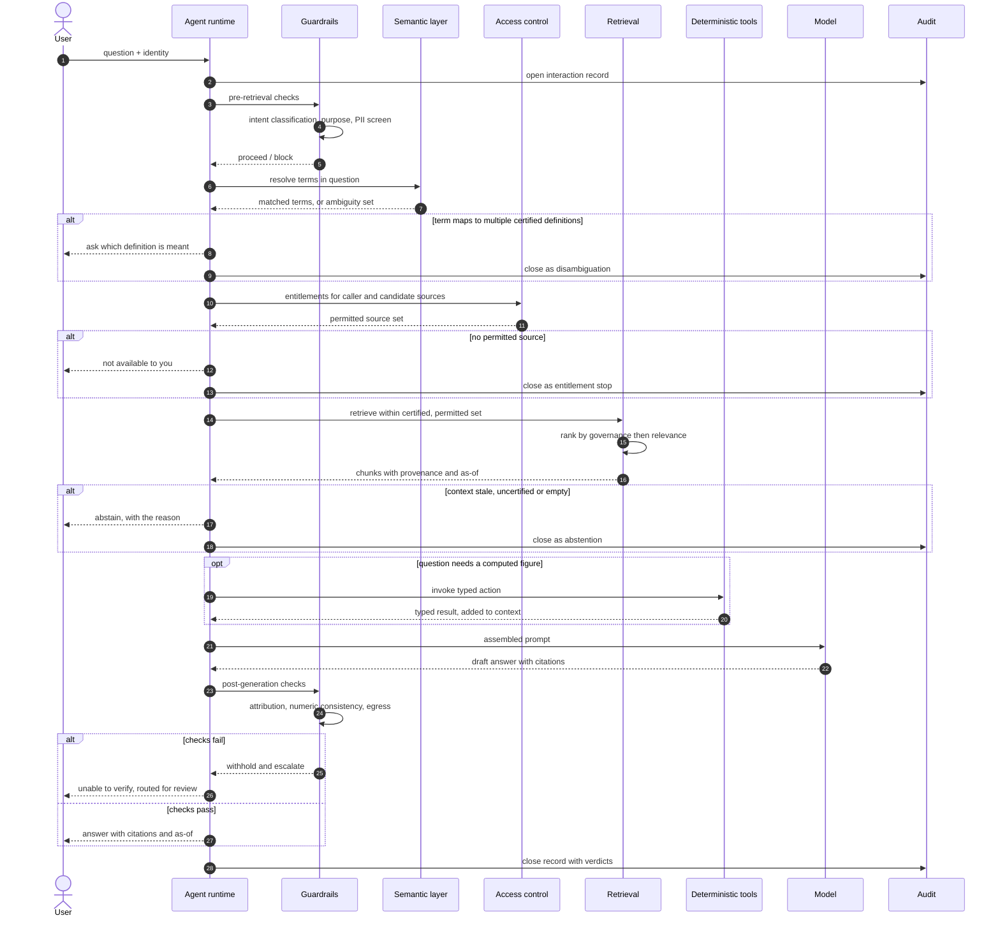

# Grounding Reference Architecture

> The layers that sit between a data governance function and an agentic AI platform, what each is accountable for, and how a single question travels through them.

## Contents

- [Scope and assumptions](#scope-and-assumptions)
- [Design principles](#design-principles)
- [Layer 1 — Governed data foundation](#layer-1--governed-data-foundation)
- [Layer 2 — Metadata and semantic layer](#layer-2--metadata-and-semantic-layer)
- [Layer 3 — Retrieval](#layer-3--retrieval)
- [Layer 4 — Agent runtime](#layer-4--agent-runtime)
- [Layer 5 — Control plane](#layer-5--control-plane)
- [Component responsibilities](#component-responsibilities)
- [Query lifecycle](#query-lifecycle)
- [Anti-patterns](#anti-patterns)
- [Where this architecture is weak](#where-this-architecture-is-weak)

---

## Scope and assumptions

This describes a **read-oriented enterprise agent**: one that answers questions and produces analysis over internal data, and may take narrow, reversible actions. Agents whose primary purpose is to write to systems of record need everything here plus a transaction control model that is out of scope for this document.

Three assumptions:

1. **The organisation already has, or can create, a certified data layer.** Not all data — a defined subset that has been curated for reuse. If nothing is certified, start with [`../governance/data-readiness-assessment.md`](../governance/data-readiness-assessment.md) instead of building.
2. **Questions are predominantly definitional or factual.** "What is X", "what was X at time T", "which X have property P". These have deterministic answers. Open-ended synthesis is a different, harder problem with a lower accuracy ceiling.
3. **Being wrong is expensive.** If it is not, the controls below are over-engineering. Match the control weight to the consequence.

---

## Design principles

**Govern before you retrieve.** Certification, entitlement, freshness and ambiguity are all decidable before a model is invoked. Every check moved earlier in the pipeline is cheaper, more deterministic and more auditable than the equivalent check applied to generated text. A post-generation filter is the last line of defence, not the first.

**Definitions are contracts.** A metric with an owner, a grain, a unit, an as-of and a physical mapping can be tested, versioned and cited. A metric described in a wiki page cannot.

**Provenance travels with the payload.** Every unit of context carries its own source, dataset, certification state, as-of timestamp and owner. Provenance re-attached after the fact is guesswork.

**Determinism where determinism is possible.** Numbers, aggregations, filters and joins are computed by tools. The model routes, narrates and explains. This is the single highest-leverage architectural decision in the whole pattern.

**Abstention is a feature.** An agent that says "I cannot answer that from certified data" is behaving correctly. Systems that never refuse are not more capable; they are less honest.

---

## Layer 1 — Governed data foundation

The set of data that is permitted to ground an answer. Membership is a governance decision, not a technical one.

### Certification

Certification is a **statement of accountability**, not a quality score. A dataset is certified when a named individual accepts that it is fit for a declared purpose and agrees to be told when it breaks.

A certification record should carry:

| Attribute | Why it exists |
| --- | --- |
| Accountable owner (a person, not a team inbox) | Someone must answer for it at 9am on a bad day |
| Delegated steward | Day-to-day custody, distinct from accountability |
| Declared purpose and permitted uses | Prevents drift from "monthly reporting" to "customer-facing agent" |
| Quality SLA and current status | Makes fitness measurable rather than asserted |
| Freshness SLA and publication schedule | Certification is not currency |
| Sensitivity classification | Drives entitlement and masking |
| Review cadence and last review date | Certification decays; unreviewed means uncertified |
| Deprecation and successor | Nothing is retired cleanly without this |

**Certification tiers.** A binary flag forces everything into a single standard and makes certification either unachievable or meaningless. Three tiers work better:

| Tier | Meaning | May ground |
| --- | --- | --- |
| **Certified** | Owned, quality-measured, SLA-backed, reviewed | Customer-facing and decision-support agents |
| **Managed** | Owned and documented, no formal SLA | Internal agents, with the tier disclosed in the answer |
| **Exploratory** | Anything else | Nothing user-facing; sandbox agents only |

The tier must be **visible in the retrieved context**, not just recorded in a catalogue, so it can appear in the answer and in the audit trail.

### Quality SLAs

Quality only means something when it is measured against a threshold with a consequence. Measure at minimum: completeness, validity, uniqueness, timeliness, and consistency against a reference.

Two rules that matter for agents specifically:

- **Thresholds gate grounding.** A dataset that drops below its threshold should be *automatically* demoted out of the agent-facing surface. Manual demotion happens after the incident, which is too late.
- **Measurement results are themselves groundable.** "How complete is this data?" is a legitimate user question. If the quality service is retrievable, the agent can answer it honestly instead of asserting that the data is fine.

### Freshness

Track four separate timestamps; conflating them is a common and expensive mistake.

| Timestamp | Meaning |
| --- | --- |
| **Event time** | When the thing happened in the world |
| **Ingestion time** | When it arrived in the platform |
| **Publication time** | When the certified version became available |
| **As-of** | The point in time the data *represents* |

**As-of is the one the user cares about** and the one that must reach the answer. A position snapshot published at 06:00 today with an as-of of yesterday's close answers "what was it at close" and does not answer "what is it now". Encoding a per-dataset freshness tolerance turns this from a judgement call into a gate — see the treasury scenario in [`../examples/glossary_grounding_demo.py`](../examples/glossary_grounding_demo.py).

---

## Layer 2 — Metadata and semantic layer

The translation layer between how the business speaks and how the data is stored. Covered in depth in [`semantic-layer-for-agents.md`](semantic-layer-for-agents.md); the architectural essentials:

**Glossary terms map to physical columns.** A term that does not resolve to a column, a filter and a grain is prose. The mapping is the difference between a glossary that documents intent and one that can serve retrieval.

**Metric definitions are first-class objects** with their own identity, version, owner and lifecycle — not a comment on a dashboard. Two agents, two dashboards and a regulatory report should resolve "Active Customer" to the same definition object, or the organisation has a governance problem that predates AI.

**Synonyms and aliases are data.** "Client", "customer", "counterparty" and "party" may be four words for one concept or four distinct concepts. Both cases are fine; what is not fine is the mapping living only in the heads of the people who built the warehouse.

**Ambiguity is modelled, not resolved.** Where one business term maps to several certified definitions, the semantic layer must return *all* of them and let the agent ask. Silently picking a winner is the failure mode described in the README.

---

## Layer 3 — Retrieval

The layer where most enterprise agent programmes go wrong, because the default architecture inherited from consumer RAG is a poor fit for enterprise data.

### The core claim

> **Most enterprise "what is X" questions are structured lookups, not vector searches.**

"How do we define an active customer?" has one correct answer, sitting in one row of a glossary table, addressable by key. Embedding that row, embedding the question, and hoping cosine similarity puts it first is strictly worse than looking it up: it is slower, costs more, is harder to explain, and introduces a ranking failure mode that did not previously exist. If the retrieved definition is wrong, the answer is wrong, and no downstream guardrail will notice because the answer is perfectly grounded in the wrong context.

Vector retrieval is genuinely valuable — over **unstructured prose** where the user's vocabulary cannot be predicted: policy documents, procedure manuals, contract text, meeting notes, support transcripts. That is what it is for. Reaching for it over a governed glossary is using a search engine to look up a primary key.

### Choosing a retrieval mode

| Question shape | Mode | Rationale |
| --- | --- | --- |
| "What does X mean?" | **Structured lookup** on glossary/metric registry | Exactly one certified answer exists and is addressable |
| "What was metric M for period P?" | **Deterministic query tool** with typed parameters | The number must be computed, never generated |
| "Which datasets contain attribute A?" | **Structured lookup** on catalogue | Catalogue is a database; query it |
| "Who owns dataset D?" | **Structured lookup** on catalogue | Same |
| "What does our policy say about X?" | **Vector or hybrid** over document store | Prose, unpredictable vocabulary, no key |
| "Summarise recent activity on account A" | **Structured filter, then generate** | Entitlement-filtered rows, model narrates |
| "Why did M move between P1 and P2?" | **Deterministic query, then generate** | Compute the change; the model explains it |
| "Find anything relevant to topic T" | **Hybrid** | Genuinely exploratory; the weakest guarantees |

### Hybrid retrieval

Hybrid earns its place when a question spans registered concepts and free prose — "what is our policy on X and which datasets are affected". Run both, but keep them **distinguishable in the context block**: structured results carry stronger provenance guarantees than a prose chunk, and the answer should be able to say so. Merging them into one undifferentiated blob of context discards the governance signal that justified the structured path in the first place.

Practical notes:

- **Rank by governance, then relevance.** Between two chunks of similar relevance, prefer certified over managed, fresher over staler, more specific over more general. Relevance-only ranking will happily surface a stale sandbox extract above a certified table.
- **Cap and diversify context.** More context is not better; it dilutes attention and enlarges the surface for entitlement error.
- **Retrieval failure is a valid outcome.** Return empty rather than returning the least-bad match. An agent handed weak context will use it.

---

## Layer 4 — Agent runtime

### Topics, actions and tools

The common structure across platforms: an agent has a **scope** (what it is for), **topics** (recognised areas of intent with their own instructions), and **actions or tools** (things it can actually do). Names differ; the shape does not.

Two design rules matter for accuracy:

**One topic, one intent, one data contract.** Broad topics force the model to choose between tools with overlapping purposes, which is where routing errors come from. "Metric lookup", "definition lookup" and "policy question" are three topics because they have three different retrieval strategies and three different guardrail profiles.

**Deterministic actions over free generation, always, for anything countable.** An action that returns a typed result the model narrates is auditable, testable and reproducible. A number produced in prose is none of those. The distinction:

```text
Poor:  "Compute the year-on-year change in active customers and report it."
       -> the model generates a plausible number

Good:  action get_metric(metric_id, period)  -> typed result
       action compare_metric(metric_id, p1, p2) -> typed result with delta
       -> the model reports what the action returned, and cites it
```

This also makes the numeric consistency check in [`../evaluation/metrics.py`](../evaluation/metrics.py) meaningful: if every figure originates in a tool result placed in context, any figure *not* in context is by definition fabricated.

### Typed parameters

Tool parameters should be constrained enumerations wherever the domain allows: metric identifiers, period grains, reporting units, currencies. A free-text parameter is an injection point and a source of silent mismatch. `metric_id: enum` fails loudly on a bad value; `metric_name: string` fails quietly with the wrong metric.

### Prompt assembly

The runtime is responsible for building the prompt in a **fixed, versioned structure** — system framing, request context, retrieved context with provenance, question. See [`../prompts/grounded-answer-template.md`](../prompts/grounded-answer-template.md). The structure is part of the interface: evaluators, guardrails and audit records all depend on it being stable.

---

## Layer 5 — Control plane

Cuts across every layer. Detailed in [`../governance/ai-controls-mapping.md`](../governance/ai-controls-mapping.md).

### Entitlement propagation

**The caller's identity must reach the retrieval layer, and filtering must happen before candidate context is assembled.**

The two common architectures and their consequences:

| Architecture | Consequence |
| --- | --- |
| Agent retrieves under a service identity, filters the response | Restricted content has already entered a prompt, a log and possibly a cache. Filtering text after the fact is guesswork. |
| Agent retrieves under the caller's identity, filters before fetch | Unentitled content never exists in the request. Nothing to leak, nothing to redact. |

Only the second is defensible. It has real costs — per-user result caching is largely unavailable, and index-level security is harder than application-level security — and those costs are the price of the control.

Two subtleties:

- **Existence itself can be sensitive.** "You are not entitled to see this" leaks that it exists. For most internal data this is the right trade-off, since a blanket "no data found" trains users to distrust the agent. For genuinely need-to-know data it is not.
- **Derived data inherits the strictest input.** An insight computed from a restricted source is restricted, unless someone with authority has explicitly declassified the aggregate.

### Audit

The record must be sufficient to **reconstruct why a specific answer was given** — not merely that an interaction occurred. Minimum viable record:

| Field | Why |
| --- | --- |
| Interaction and session id | Correlation |
| Caller identity and entitlements applied | Was the filter correct? |
| Question as submitted | The actual input |
| Retrieval plan and tools invoked | Which path was taken |
| Context identifiers, with dataset, version and as-of | **The single most important field** |
| Prompt template id and version | Which instructions applied |
| Model and configuration identifiers | Which model produced it |
| Response, and guardrail verdicts | What was produced and what was checked |
| Escalation or override, and by whom | Human involvement |

Note what is stored: context *identifiers*, not context *content*. Storing full retrieved content duplicates sensitive data into the log estate and creates a second, less-governed copy. Store what is needed to re-fetch it under the same controls.

### Evaluation

Evaluation is a control, not a project phase. Three levels:

1. **Retrieval evaluation** — did we fetch the right context? Labelled question-to-context set; measure precision and recall. Failures here are invisible to every downstream check.
2. **Answer evaluation** — is the answer grounded, cited, numerically consistent, correctly abstaining? Automatable as a regression gate; see [`../evaluation/`](../evaluation/).
3. **Outcome evaluation** — did users act on it, correct it, or escalate? The only level that measures value rather than behaviour.

Most programmes do only the second, because it is the easiest to automate. The first is where the accuracy actually comes from.

---

## Component responsibilities

| Component | Owns | Must not own | Primary failure if absent |
| --- | --- | --- | --- |
| **Data catalogue** | Dataset inventory, certification state, ownership, sensitivity | Business meaning of metrics | Nobody can tell certified from convenient |
| **Business glossary** | Certified term definitions, synonyms, stewardship | Physical storage detail | Every consumer invents its own definition |
| **Metric registry** | Metric contracts: definition, grain, unit, mapping, version | Presentation and formatting | Same question, different numbers |
| **Lineage service** | Column-level provenance, transformation history | Access decisions | Answers cannot be defended in audit |
| **Quality service** | Measurement, thresholds, status, trend | Remediation of the source | Silent decay into wrongness |
| **Identity resolution** | Unified party view, match rules, confidence | Entitlement decisions | Fragmented answers; entitlement applied to the wrong record |
| **Access control service** | Entitlement evaluation for a caller and resource | Data transformation | Retrieval becomes a bypass channel |
| **Retrieval service** | Mode selection, ranking, entitlement-filtered fetch, provenance attachment | Answer generation | Right model, wrong context |
| **Agent runtime** | Intent routing, tool invocation, prompt assembly | Metric computation, authorisation | Numbers generated instead of computed |
| **Guardrail service** | Pre and post checks, escalation routing | Business definitions | Failures reach users first |
| **Audit store** | Immutable interaction records | Operational analytics | No defence, no diagnosis |
| **Evaluation harness** | Regression gates, drift detection | Production traffic decisions | Silent degradation between releases |

---

## Query lifecycle



### Where each failure mode is caught

| Failure | Caught at | If that gate is missing |
| --- | --- | --- |
| Ambiguous metric | Steps 6–8, semantic resolution | Two users, two numbers, both defensible |
| Entitlement bypass | Steps 10–13, before any retrieval | Restricted content in prompts and logs |
| Uncertified source | Step 14, certified and permitted source set | Sandbox extract answers client questions |
| Stale data | Steps 16–17, freshness gate on retrieved context | February's figure presented in August |
| Fabricated number | Steps 19–20 tool use, step 24 numeric check | Confident, precise, wrong |
| Unciteable answer | Step 24, attribution check | Cannot be defended in audit |

The alternating paths are the point. In a well-governed implementation a large share of questions terminate at steps 8, 12 or 17 — disambiguation, entitlement stop, or abstention — without a model ever being invoked. Those are successful outcomes, and they should be measured as such rather than counted as deflections.

---

## Anti-patterns

**Index everything, govern later.** The index becomes the de facto data estate, inheriting none of the controls of the systems it copied from. Governance retrofitted onto an index is a migration, not a configuration change.

**Post-hoc entitlement filtering.** Retrieving broadly and filtering the response. The content has already entered the prompt and the logs, and filtering generated text for a value you should not have retrieved is not a control.

**The glossary as a document.** A glossary nothing queries is documentation. If retrieval cannot read it, it is not part of the architecture.

**Prompt engineering as the remedy for data problems.** Every hour spent rewording instructions to stop an agent conflating two revenue definitions is an hour not spent registering the two definitions.

**Uniform freshness policy.** One global staleness threshold is either too strict for policy text or far too lax for positions. Freshness tolerance is per-dataset, per-question-type, and a business decision.

**Evaluating only the answer.** If retrieval fetched the wrong context, a well-formed, well-cited, perfectly grounded answer will be wrong, and every answer-level metric will report success.

**Single certification tier.** Binary certification makes the bar either unreachable or meaningless. Tiers with different permitted uses are what make it operable.

---

## Where this architecture is weak

Stated plainly, because a pattern that claims no weaknesses is marketing.

**It is expensive up front.** The semantic layer and certification programme are substantial work before the first agent answers a question. For low-stakes internal use cases this is disproportionate. Match control weight to consequence.

**It constrains the question space.** Optimising for definitional and factual questions means genuinely exploratory analysis is served worse. Some organisations need a second, clearly-labelled, lower-assurance path for exploration — and users must be able to tell which one they are talking to.

**Semantic layers drift.** A registry that is not maintained becomes wrong in the most damaging way: confidently, with an owner's name attached. Review cadence is not optional, and unreviewed definitions should decay out of the certified tier automatically.

**Ambiguity detection is only as good as alias coverage.** The mechanism catches conflicts the registry knows about. Unregistered synonyms fail silently — and that is the residual risk that human review and user feedback exist to catch.

**Entitlement-aware retrieval costs performance.** Per-user filtering limits cache reuse and complicates index design. This is a real trade-off, accepted deliberately.

**Lexical evaluation is a floor, not a ceiling.** The evaluators in this repository detect drift and gross failure. They do not establish truth. A mature programme adds human review of a sampled population and, where it can be calibrated, model-based judging.
